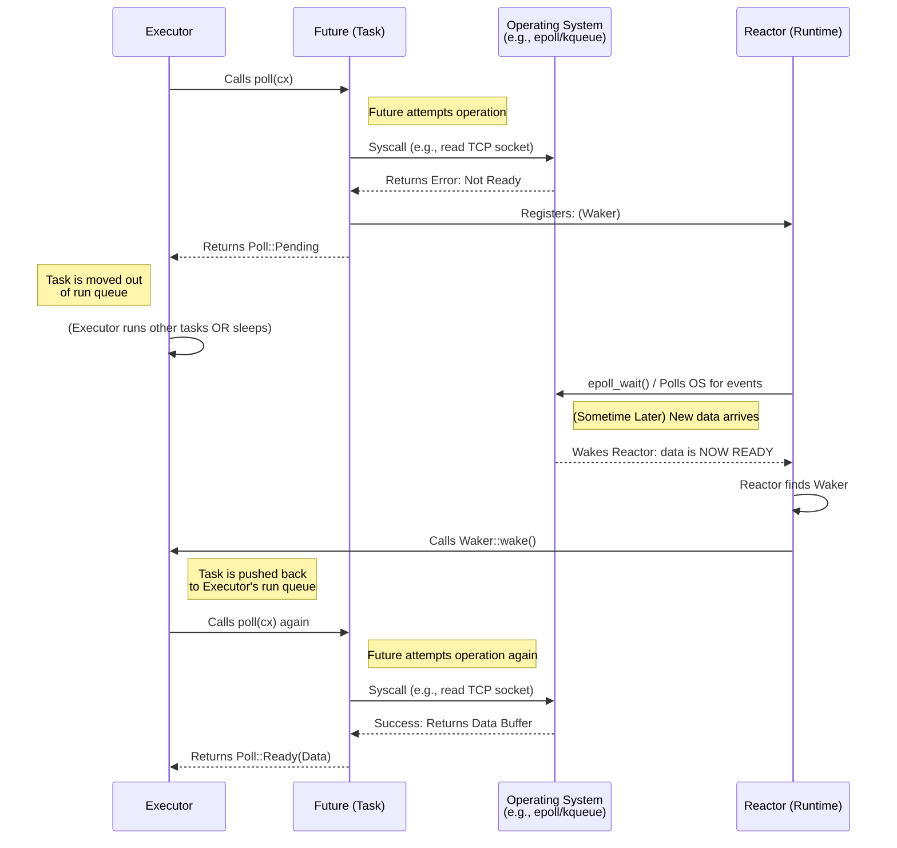
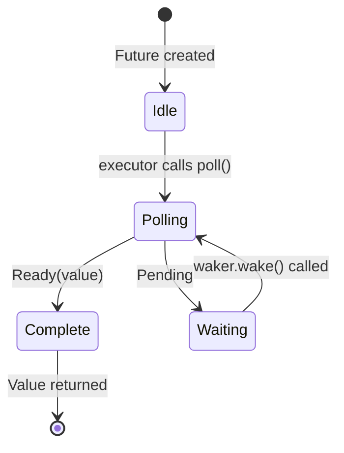
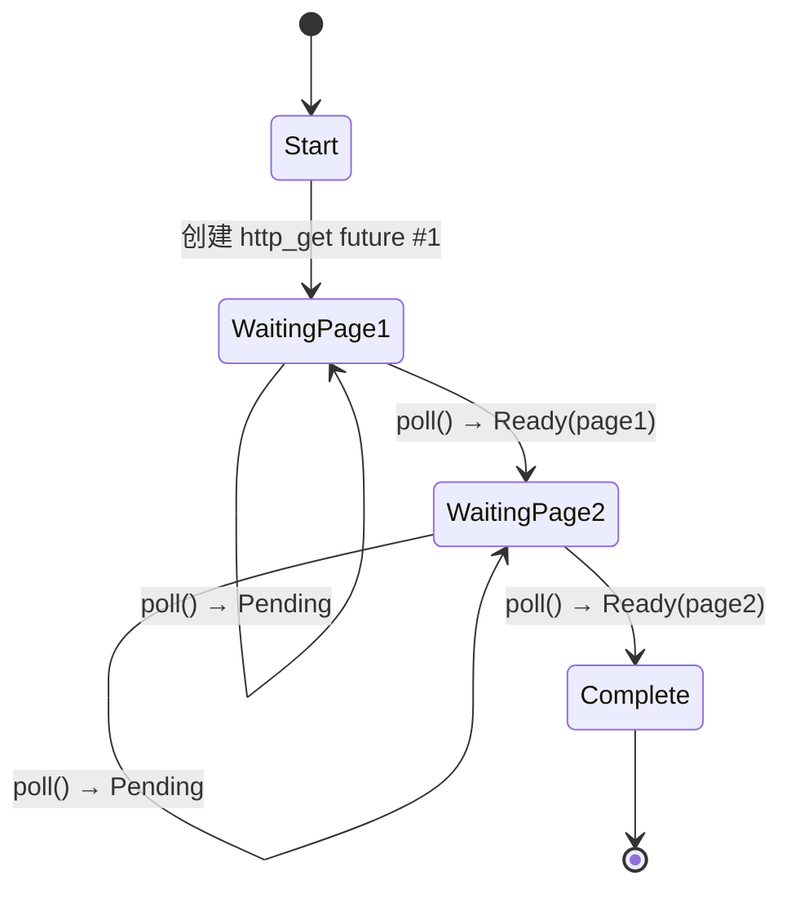
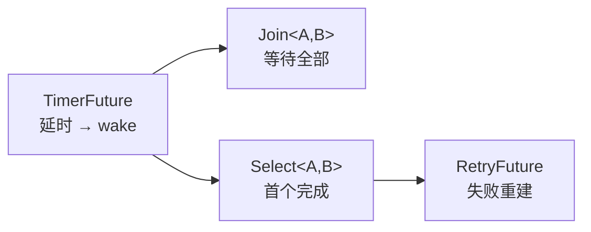

# Async Rust: From Futures to Production

## Part I:How Async Works

### 1. Why Async is Different in Rust

Rust 的 async 与 C#/JS/Go/Python 根本不同：**没有内置运行时**，无线程池、无事件循环。async 是零成本编译策略，将函数转换为实现 `Future` trait 的状态机。

**三个关键特性：**

- **惰性执行**：Future 在被 poll/await 前不会执行任何工作，可创建后直接丢弃
- **自带运行时（BYOR）**：需自选 executor（tokio、smol 等），以灵活性换便利性
- **所有权规则适用**：生命周期、`Send`、`Sync` 在 async 上下文中同样生效

**适用场景：** I/O 密集型高并发（100+ 并发操作），如处理数千连接的 Web 服务器

**不适用：** CPU 密集型任务（用线程或 `rayon`）；少于 ~10 个并发操作时，同步代码可能因避免状态机开销而更优

### 2. The Future Trait

**核心定义：**

```rust
trait Future {
    type Output;
    fn poll(self: Pin<&mut Self>, cx: &mut Context<'_>) -> Poll<Self::Output>;
}
enum Poll<T> { Ready(T), Pending }
```

**Poll 时序图：**



**关键组件：**

- **`Pin<&mut Self>`**：防止 Future 在内存中移动，因为异步状态机可能包含自引用
- **`Context` / `Waker`**：Future 返回 `Pending` 时**必须**注册 `waker.wake()` 回调，否则任务将**永久挂起（silent hang）**

**Waker 契约（与其他语言的核心差异）：**

> Rust 不会自动唤醒任务。返回 `Pending` 时，开发者必须确保 `wake()` 最终被调用。忘记注册 = 程序静默挂起。

**epoll 机制（Linux，macOS 对应 kqueue）：**

- `epoll_create1()`：创建 epoll 实例，返回 epoll fd，Runtime 初始化时调用一次
- `epoll_ctl(epfd, op, fd, event)`：注册/修改/移除监听的 fd（`EPOLL_CTL_ADD/MOD/DEL`），**线程安全**，Worker 线程可随时调用
- `epoll_wait(epfd, events, max, timeout)`：**阻塞 syscall**，1 个 Reactor 线程同时监听所有 fd，OS 挂起线程直到事件就绪或超时，CPU 开销几乎为零
- `eventfd`（辅助）：Reactor 阻塞时需要立即唤醒，写入预注册的 eventfd 即可让 `epoll_wait()` 返回

**Delay 示例要点：** 存储完成状态 + 缓存 Waker + 后台线程到期后调用 `wake()` → Executor 再次 poll → `Ready(())`

### 3. How Poll Works

**Future 状态机：**



> Waiting 状态下**必须**已向 I/O 源注册 Waker，否则永久挂起。

**最小 Executor（`block_on`）实现要点：**

1. `pin!()` 将 Future 固定在栈上
2. 创建 no-op Waker（通过 `RawWakerVTable`）
3. 循环调用 `future.poll()`，`Ready` 则返回，`Pending` 则 yield 线程
4. 这是忙轮询，仅用于教学；生产 Executor 基于 epoll/kqueue/io_uring 事件驱动休眠

**poll() 实现四原则：**

1. **永远不要阻塞** — `poll()` 内不能调用阻塞操作
2. **每次都重新注册 Waker** — Executor 可能在不同 poll 间更换 Waker
3. **处理虚假唤醒（spurious wake）** — 被唤醒时 I/O 未必就绪，需重新检查条件
4. **Ready 后不再 poll** — 行为未定义

**防竞态的 double-check 模式：**

```rust
fn poll(self: Pin<&mut Self>, cx: &mut Context<'_>) -> Poll<T> {
    if self.is_ready() { return Poll::Ready(value); }  // 1. 先检查
    self.store_waker(cx.waker());                        // 2. 注册 Waker
    if self.is_ready() { return Poll::Ready(value); }  // 3. 再检查（防竞态）
    Poll::Pending
}
```

**实用工具函数：**

- **`poll_fn(|cx| ...)`**：用闭包创建一次性 Future，适合将回调 API 桥接到 async
- **`yield_now().await`**：让出 Executor 线程，防止 CPU 密集循环独占线程，实现协作式调度

### 4. Pin and Unpin

**为什么需要 Pin：自引用结构问题**

编译器将 `async fn` 转换为状态机时，状态机可能包含指向自身字段的引用（自引用结构）。若该结构在内存中被移动，内部指针将变为悬垂引用，导致内存不安全。

```
移动前（有效）：data 在 0x1000，内部指针 → 0x1000 ✓
移动后（无效）：data 移到 0x2000，内部指针仍 → 0x1000 ✗（悬垂）
```

`Pin<P>` 包装指针类型，**禁止对底层值执行移动操作**（`mem::swap`、`mem::replace` 等），从而保护自引用结构的内存安全。

**Pin 核心特性：**

- 适用于任意指针类型（引用、`Box`、自定义指针）
- 仅阻止移动，不阻止读取和修改
- `poll()` 签名中的 `Pin<&mut Self>` 确保所有 Future 都通过 Pin 被 poll

**Unpin Trait：逃生通道**

`Unpin` 是 auto-trait，标记类型即使被 Pin 包装也可安全移动。大多数标准库类型自动实现 `Unpin`（因为不含自引用）。

| 自动 `Unpin` | `!Unpin` |
|---|---|
| 基本类型：`i32`, `bool`, `f64` | `async fn` / `async {}` 生成的状态机 |
| 集合：`String`, `Vec<T>`, `HashMap` | 含自引用的自定义 Future |
| 指针：`Box<T>`, `&T`, `&mut T` | |

> 手写 Future 若**无自引用**，应实现 `Unpin` 以简化使用。

**三种 Pin 模式：**

**1. 堆固定 `Box::pin()`** — 安全默认选择

```rust
let future = async { 42 };
let pinned: Pin<Box<dyn Future<Output = i32>>> = Box::pin(future);
```

Future 分配在堆上，移动 `Box` 只移动指针，Future 本体不动。适用于存入集合、从函数返回。

**2. 栈固定 `tokio::pin!()`** — 局部使用

```rust
let future = async { 42 };
tokio::pin!(future);
// future: Pin<&mut impl Future>
```

将 Future 固定在栈上，原始绑定被消费，后续必须使用重绑定的变量。适用于 `select!` 或手动 poll 场景。

**3. `Pin::new()` — 仅限 `Unpin` 类型**

```rust
let mut data = String::from("hello");
let pinned: Pin<&mut String> = Pin::new(&mut data);
```

对 `!Unpin` 类型编译失败，需改用 `Box::pin()` 或 `unsafe Pin::new_unchecked()`。

**函数签名中的 Pin：**

| 场景 | 方式 | 用途 |
|---|---|---|
| 堆固定 Future | `Box::pin(future)` | 存入集合、函数返回 |
| 栈固定 Future | `tokio::pin!(future)` | `select!` / 手动 poll |
| 接受已固定 Future | `future: Pin<&mut F>` | 函数签名 |
| 要求可移动 Future | `F: Future + Unpin` | Future 创建后仍需移动 |

**核心要点：**

1. Pin 防止 `async fn` 生成的自引用状态机被移动
2. `Box::pin()` 是固定 `!Unpin` Future 的安全默认方案
3. `tokio::pin!()` 栈固定，可移动包装器本身
4. `Unpin` 是 auto-trait，仅编译器生成的异步状态机不实现它
5. 大多数 async 代码中 Pin 是透明的，主要在类型签名和手动管理 Future 时接触

### 5. The State Machine Reveal

**核心命题：** 编译器将 `async fn` 转换为基于 `enum` 的状态机，每个 `.await` 点对应一个 enum variant。

**源码 vs 生成的状态机：**

```rust
// 源码
async fn fetch_two_pages() -> String {
    let page1 = http_get("https://example.com/a").await;
    let page2 = http_get("https://example.com/b").await;
    format!("{page1}\n{page2}")
}

// 编译器生成（概念上）
enum FetchTwoPagesStateMachine {
    Start,
    WaitingPage1 { fut1: HttpGetFuture },
    WaitingPage2 { page1: String, fut2: HttpGetFuture },
    Complete,
}
```

**`poll()` 的执行逻辑：** 在 `loop` 中 `match` 当前状态；每个分支先 poll 内部 Future，`Pending` 则返回，`Ready` 则推进到下一个状态；`Complete` 再被 poll 属未定义行为（`panic!`）。

**状态转移图：**



**性能特征：**

- **零成本**：状态机是栈上分配的 enum，无堆分配、无 GC、无装箱（除非显式 `Box::pin()`）
- **Size = max(所有 variant 的 size)**：每个 `.await` 都新增一个 variant，最终 Future 大小取决于**最大**的那个变体
- **Drop 优化**：状态转移时，编译器自动插入 drop 释放不再需要的值。例如 `WaitingPage1 → WaitingPage2` 时 `fut1` 立即被丢弃，不会拖累后续状态大小

**大栈分配陷阱：**

```rust
async fn big() {
    let buf: [u8; 1_000_000] = [0; 1_000_000]; // ⚠️ 1MB 栈数据
    some_io().await;
    process(&buf);
}
// Future size ≈ 1MB + 内部 Future 大小 → 容易栈溢出
```

> 实用规则：在 `async fn` 中避免大数组栈分配，改用 `Vec<u8>` / `Box<[u8]>`；若整体 Future 过大，用 `Box::pin()` 将其放到堆上。

**`.await` 点 = 状态变体：**

| 源码结构 | 影响 |
|---|---|
| 每个 `.await` | 新增一个 enum variant |
| `?` / 条件分支 | **不**产生新状态，只是 `match` Poll 结果的早退路径 |
| 跨 await 的局部变量 | 作为字段存入对应 variant |
| await 前就丢弃的变量 | 不会进入后续 variant（drop 优化） |

**预测练习：**

```rust
async fn pipeline(url: &str) -> Result<usize, Error> {
    let response = fetch(url).await?;
    let body = response.text().await?;
    let parsed = parse(body).await?;
    Ok(parsed.len())
}
```

→ 5 个状态：`Start(url)` / `WaitingFetch(url, fut)` / `WaitingText(response, fut)` / `WaitingParse(body, fut)` / `Done`

**核心要点：**

1. `async fn` → enum 状态机，每个 `.await` 是一个状态
2. Future 内存大小 = 所有 variant 中最大者，大栈值会显著放大
3. 编译器在状态转移时自动 drop 不再需要的局部变量
4. 真实编译结果使用 unsafe pin projection，因为状态机是 `!Unpin`（正是第 4 章需要 Pin 的原因）
5. Future 过大时用 `Box::pin()` 上堆

## Part II: The Ecosystem

### 6. Building Futures by Hand

**本章命题：** 手写 Timer / Join / Select / Retry 四个组合子，验证「Future = 状态 + `poll()` + Waker 注册」，并展示组合子嵌套构建。

#### 6.1 TimerFuture：带唤醒的定时器

**共享状态 + 后台线程 + Waker** 的经典模式：

```rust
struct SharedState {
    completed: bool,
    waker: Option<Waker>,
}

pub struct TimerFuture {
    shared_state: Arc<Mutex<SharedState>>,
}

impl TimerFuture {
    pub fn new(duration: Duration) -> Self {
        let shared_state = Arc::new(Mutex::new(SharedState {
            completed: false,
            waker: None,
        }));
        let ts = Arc::clone(&shared_state);
        thread::spawn(move || {
            thread::sleep(duration);
            let mut state = ts.lock().unwrap();
            state.completed = true;
            if let Some(waker) = state.waker.take() {
                waker.wake();
            }
        });
        TimerFuture { shared_state }
    }
}

impl Future for TimerFuture {
    type Output = ();
    fn poll(self: Pin<&mut Self>, cx: &mut Context<'_>) -> Poll<()> {
        let mut state = self.shared_state.lock().unwrap();
        if state.completed {
            Poll::Ready(())
        } else {
            state.waker = Some(cx.waker().clone()); // ⚠️ 每次都更新
            Poll::Pending
        }
    }
}
```

> ⚠️ 每个 Timer 一个 OS 线程，仅供学习。生产用 `tokio::time::sleep` — 共享 timer wheel，零额外线程。

#### 6.2 Join：等待两者都完成

**并发 ≠ 并行**：在同一次 `poll()` 中交替 poll 两个子 Future，依赖协作式调度。

```rust
enum MaybeDone<F: Future> {
    Pending(F),
    Done(F::Output),
    Taken,
}

pub struct Join<A: Future, B: Future> {
    a: MaybeDone<A>,
    b: MaybeDone<B>,
}

// Output 不能自动推导 Unpin，手写 Unpin（未做 pin-projection，安全）
impl<A: Future + Unpin, B: Future + Unpin> Unpin for Join<A, B> {}

impl<A: Future + Unpin, B: Future + Unpin> Future for Join<A, B> {
    type Output = (A::Output, B::Output);
    fn poll(self: Pin<&mut Self>, cx: &mut Context<'_>) -> Poll<Self::Output> {
        let this = self.get_mut();
        if let MaybeDone::Pending(ref mut f) = this.a {
            if let Poll::Ready(v) = Pin::new(f).poll(cx) { this.a = MaybeDone::Done(v); }
        }
        if let MaybeDone::Pending(ref mut f) = this.b {
            if let Poll::Ready(v) = Pin::new(f).poll(cx) { this.b = MaybeDone::Done(v); }
        }
        match (&this.a, &this.b) {
            (MaybeDone::Done(_), MaybeDone::Done(_)) => {
                let a = if let MaybeDone::Done(v) = std::mem::replace(&mut this.a, MaybeDone::Taken) { v } else { unreachable!() };
                let b = if let MaybeDone::Done(v) = std::mem::replace(&mut this.b, MaybeDone::Taken) { v } else { unreachable!() };
                Poll::Ready((a, b))
            }
            _ => Poll::Pending,
        }
    }
}
```

> 用法：`Join::new(Box::pin(fut_a), Box::pin(fut_b)).await` — `async {}` 块是 `!Unpin`，需 `Box::pin` 包装。

#### 6.3 Select：谁先完成谁赢

```rust
pub enum Either<A, B> { Left(A), Right(B) }

pub struct Select<A, B> { a: A, b: B }

impl<A: Future + Unpin, B: Future + Unpin> Future for Select<A, B> {
    type Output = Either<A::Output, B::Output>;
    fn poll(mut self: Pin<&mut Self>, cx: &mut Context<'_>) -> Poll<Self::Output> {
        if let Poll::Ready(v) = Pin::new(&mut self.a).poll(cx) { return Poll::Ready(Either::Left(v)); }
        if let Poll::Ready(v) = Pin::new(&mut self.b).poll(cx) { return Poll::Ready(Either::Right(v)); }
        Poll::Pending
    }
}
```

**典型用法 — 超时：**

```rust
match Select::new(http_get(url), TimerFuture::new(timeout)).await {
    Either::Left(resp) => ...,   // 请求成功
    Either::Right(()) => ...,    // 超时
}
```

> **公平性提示**：此实现总先 poll A，同时就绪时 A 必胜。`tokio::select!` 宏会随机化 poll 顺序以避免饥饿。

#### 6.4 RetryFuture：失败重试

组合子本身也是状态机，失败时**重新创建**内部 Future：

```rust
pub struct RetryFuture<F, Fut, T, E>
where F: Fn() -> Fut, Fut: Future<Output = Result<T, E>>,
{
    factory: F,
    current: Option<Pin<Box<Fut>>>, // Pin<Box<_>> 永远 Unpin，省掉 Fut: Unpin 约束
    remaining: usize,
    last_error: Option<E>,
}

// poll() 循环：
// - 内部 fut Ready(Ok)  → 返回 Ok
// - 内部 fut Ready(Err) → remaining > 0 则重建 Future 继续 loop；否则返回 Err
// - Pending             → 返回 Pending
```

> `Pin<Box<Fut>>` 技巧：`Pin<Box<T>>` 无条件 `Unpin`，因此外层结构自动 `Unpin`，无需 unsafe pin-projection，且支持任意 Future 类型。

#### 组合子层次关系



#### 核心要点

1. **Future 三要素**：状态 + `poll()` 实现 + Waker 注册（`Pending` 前必须 `state.waker = Some(cx.waker().clone())`）
2. **Join 的"并发"是交替 poll**，不是并行，属协作式并发
3. **组合子嵌套构造**：Future 里包 Future，一路嵌套下去（turtles all the way down）
4. **`Pin<Box<Fut>>` 技巧**：消除 `Fut: Unpin` 约束，结构自动 `Unpin`，避免 unsafe
5. **手写仅用于理解**：生产直接用 `tokio::join!` / `tokio::select!` / `tokio::time::sleep`

## Part III: Production Async
